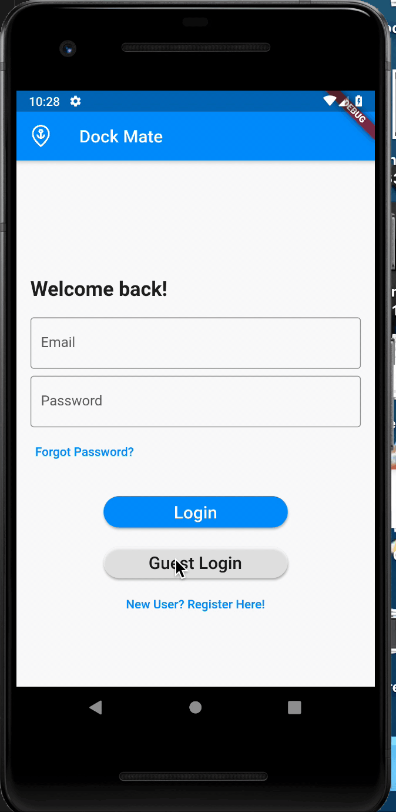
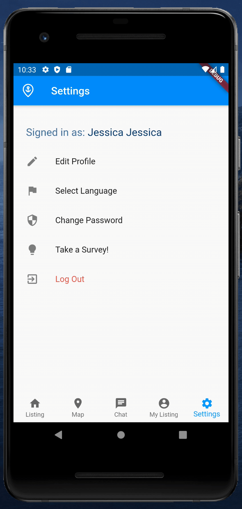
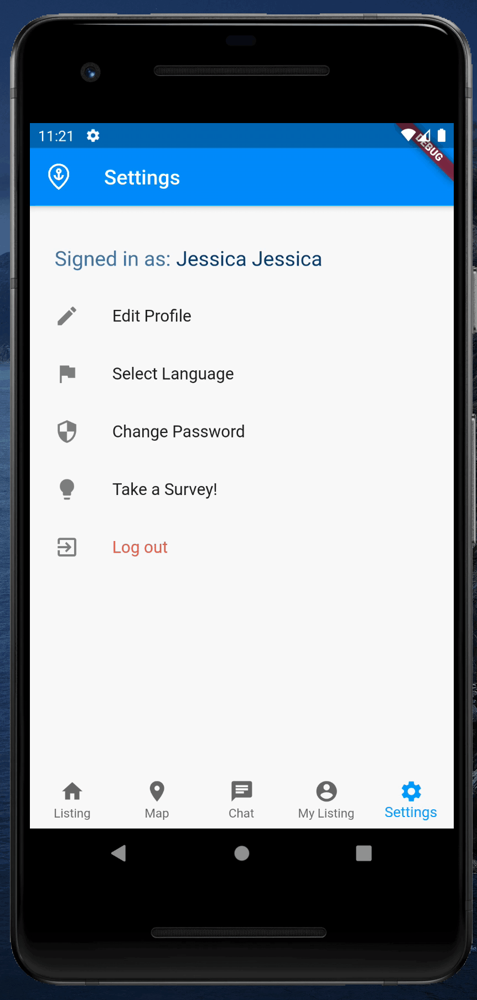

# Major Group Project
The starter code for the major group project.

Group members (3-5) (no Student IDs, only names):
1. Sunny Cho @ [Sunnyc317](https://github.com/Sunnyc317)
2. Jessica @ [jwdjj](https://github.com/jwdjj)
3. Naida Tania @ [NaidaTania](https://github.com/NaidaTania)

## Overview
This application is to provide students to find housing easier

## How to run

1. Clone this repository, all the **final work is under master branch**
2. Run `cd dockmate`
3. Run `flutter run`

Note for testing:
a. You can use "Guest Login"
b. If you need to test as registered user, use the following credential:
```
email: jessica.jessica@ontariotechu.net
password: 11111111
```
c. You can register, make sure it's a valid email to do the verification


## Folder Structure

We have 3 main folders:
- model: where all the database and classes are organized in
- pages: where all the UI and part of the backend are in
- utils: common functionalities (e.g. notification), wrapper classes, and others

Inside `pages`, we organize them by page category:
- authentication: this is for registration and login related activity, where the username is being initialized/set for other pages
- chat: this is where all the chat related to the user will be displayed and where the interaction will happeng between user and current chatbot in place
- post: listview of the public and individual listings as well as the forms related to add and edit the post
- Settings: user will find pages to edit their profile (name, email), change their password, change the app language, and logout in this folder
- map.dart: the page where it shows all the postings locations

## Functionalities

1. [Registration](#registration)
2. [Guest Login - Sign Out](#guest-login-and-sign-out)
3. [Forgot Password](#forgot-password)
4. [Login](###login)
5. [Listings and My Listings](#listings-and-my-listings)
6. [Search and Filter Listings](#search-and-filter-listings)
7. [Chat and Chatbot](#chat-and-chatbot)
8. [Map](#map)
9. [CRUD Listings](#crud-listings)
10. [Edit Profile](#edit-profile)
11. [Survey](#survey)
12. [Change Language](#change-language)

### Registration
<center></center>

### Guest Login and Sign Out
<center></center>

### Forgot Password
<center></center>

### Login
<center></center>

### Listings and My Listings
<center></center>

### Search and Filter Listings
<center></center>

### Chat and Chatbot

Shorsh and Messages
<center></center>


Guest View Chat (Shorsh)
<center></center>


Delete Chat (do long tap)
<center></center>

### Map
<center></center>

### CRUD Listings

Create
<center></center>

Update and Delete
<center></center>

### Edit profile
<center></center>

### Survey
<center></center>

### Change Language
<center></center>
